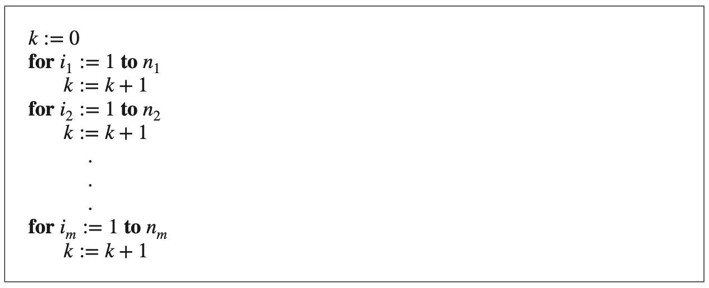
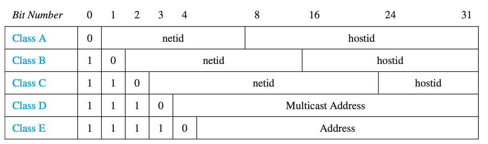

# Counting and Combinatorics

Source: Rosen Book 

## Section 1 : Product Rule
---

## Q001

[MCQ]

A new company with just two employees, Sanchez and Patel, rents a floor of a building with 12 offices. How many ways are there to assign different offices to these two employees?

- **(A)** $12$
- **(B)** $12 + 11$
- **(C)** $12 * 11$
- **(D)** $12^2$

**Answer:** C

---

## Q002

[MCQ]

The chairs of an auditorium are to be labeled with an uppercase English letter followed by a positive integer not exceeding 100. What is the largest number of chairs that can be labeled differently?

- **(A)** $26 + 100$
- **(B)** $26 * 100$
- **(C)** $26^{100}$
- **(D)** $100^{26}$

**Answer:** B

---

## Q003

[MCQ]

There are 32 computers in a data center in the cloud. Each of these computers has 24 ports. How many different computer ports are there in this data center?

- **(A)** $32 + 24$
- **(B)** $32 * 24$
- **(C)** $32^{24}$
- **(D)** $24^{32}$

**Answer:** B

---
## Q004

[NAT]

How many different bit strings of length seven are there?

**Answer:** $2^7$

---
## Q005

[MCQ]

How many different license plates can be made if each plate contains a sequence of three uppercase English letters followed by three digits (and no sequences of letters are prohibited, even if they are obscene)?

- **(A)** $26 + 26 + 26 + 10 + 10 + 10$
- **(B)** $26 * 3 * 10 * 3$
- **(C)** $26^3 * 10^3$
- **(D)** $(26 * 10)^3$

**Answer:** C

---
## Q006

[NAT]

**Counting Functions :** How many functions are there from a set with m elements to a set with n elements?

**Answer:** $n^m$

---
## Q007

[NAT]

**Counting One-to-One Functions :** How many one-to-one functions are there from a set with m elements to one with n elements? Assume m<=n

**Answer:** $n (n-1)(n- 2)⋯ (n- m + 1)$

---
## Q008

[NAT]

What is the value of $k$ after the following code, where $n1, n2, … , nm$ are positive integers, has been executed?

**Answer:** $n1 * n2 * n3 ⋯ * nm$

---
## Q009

[MCQ]

**Counting Subsets of a Finite Set :** How many number of different subsets of a finite set $S$.

- **(A)** \({|S|}*{|S|}\)
- **(B)** \({|S|}\)
- **(C)** \(2*{|S|}\)
- **(D)** \(2^{|S|}\)

**Answer:** D

---

## Section 2 : Sum Rule

## Q010

[MCQ]

Suppose that either a member of the mathematics faculty or a student who is a mathematics major is chosen as a representative to a university committee. How many different choices are there for this representative if there are 37 members of the mathematics faculty and 83 mathematics majors and no one is both a faculty member and a student?

- **(A)** $37 + 83$
- **(B)** $37 * 83$
- **(C)** $83 - 37$
- **(D)** $37^{83}$

**Answer:** A

---
## Q011

[MCQ]

A student can choose a computer project from one of three lists. The three lists contain 23, 15, and 19 possible projects, respectively. No project is on more than one list. How many possible projects are there to choose from?

- **(A)** $23 * 15 * 19$
- **(B)** $23^{15+19}$
- **(C)** $23 + 15 * 19$
- **(D)** $23 + 15 + 19$

**Answer:** D

---
## Q012

[NAT]

What is the value of k after the following code, where n1, n2, … , nm are positive integers, has been executed?

**Answer:** $n1 + n2 +⋯ + nm$

---

## Section 3 : Sum Rule and Product Rule

## Q013

[MCQ]

In a version of the computer language BASIC, the name of a variable is a string of one or two alphanumeric characters, where uppercase and lowercase letters are not distinguished. (An alphanumeric character is either one of the 26 English letters or one of the 10 digits.) Moreover, a variable name must begin with a letter and must be different from the five strings of two characters that are reserved for programming use. How many different variable names are there in this version of BASIC?

- **(A)** $26 + 36^2$
- **(B)** $26 + 26 * 36 - 5$
- **(C)** $26 * 36 + 26^2$
- **(D)** $26 + 931$

**Answer:** D

---

## Q014

[NAT]

Each user on a computer system has a password, which is six to eight characters long, where each character is an uppercase letter or a digit. Each password must contain at least one digit. How many possible passwords are there?

**Answer:** $(36^6-26^6) + (36^7 - 26^7) + (36^8 - 26^8) = 2,684,483,063,360$

---
## Q015

[NAT]

**Counting Internet Addresses:** How many different IPv4 addresses are available for computers on the Internet?

Three forms of addresses are used, with different numbers of bits used for netids and hostids.
**Class A addresses**, used for the largest networks, consist of 0, followed by a 7-bit netid and a 24-bit hostid. 
**Class B addresses**, used for medium-sized networks, consist of 10, followed by a 14-bit netid and a 16-bit hostid. 
**Class C addresses**, used for the smallest networks, consist of 110, followed by a 21-bit netid and an 8-bit hostid. 

There are several restrictions on addresses because of **special uses**: 1111111 is not available as the netid of a **Class A network**, and the hostids consisting of all 0s and all 1s are not available for use in **any network**.

**Class D addresses** reserved for use in multicasting when multiple computers are addressed at a single time, consisting of 1110 followed by 28 bits.

**Class E addresses** reserved for future use, consisting of 11110 followed by 27 bits. 

**NOTE :** Neither Class D nor Class E addresses are assigned as the IPv4 address of a computer on the Internet. 

**Answer:** $(2^7 - 1)\cdot(2^{24} - 2) + 2^{14}\cdot(2^{16} - 2) + 2^{21}\cdot(2^8 - 2) = 3,737,091,842$

---

## Section 3 : Subtraction Rule

